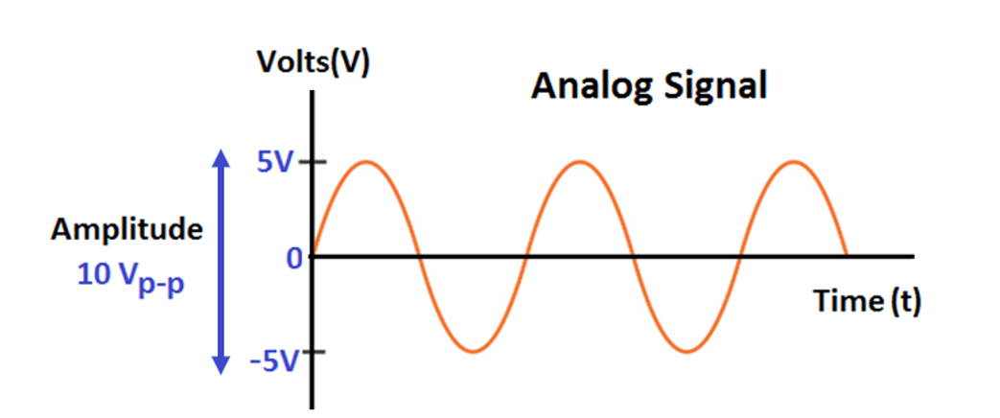
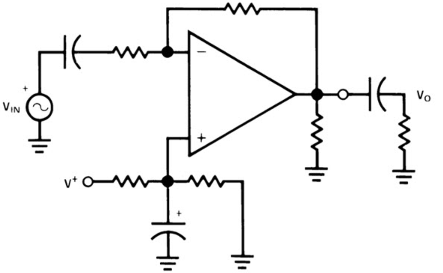
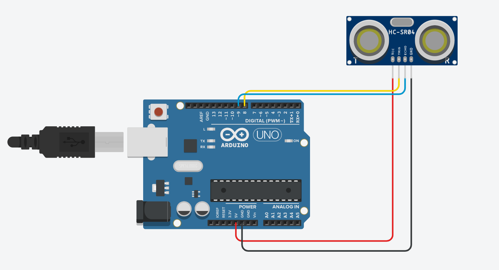
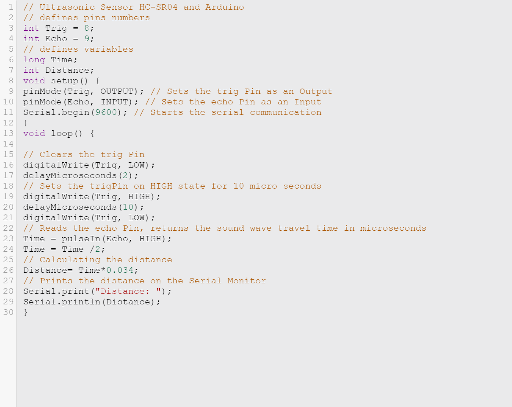
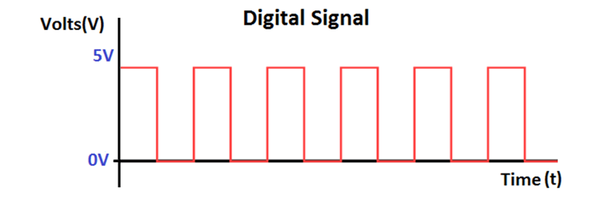
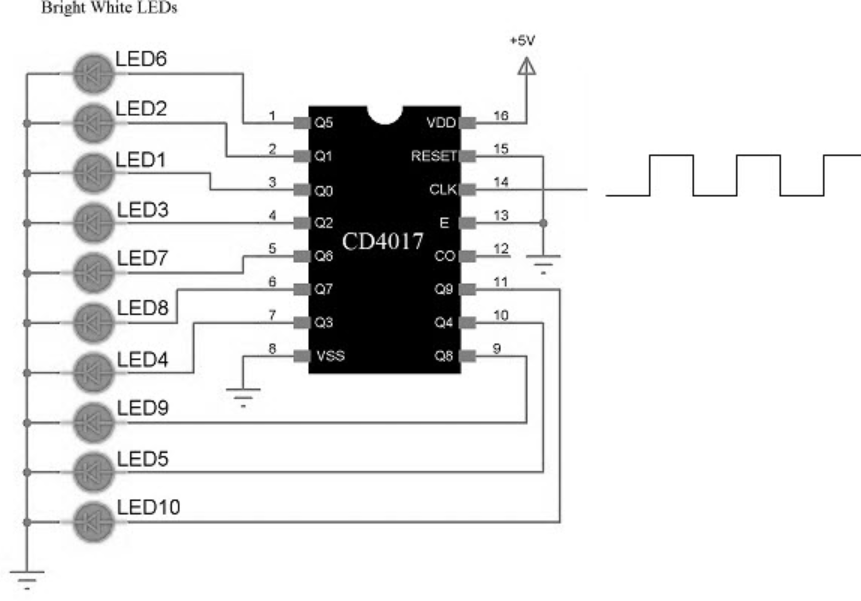
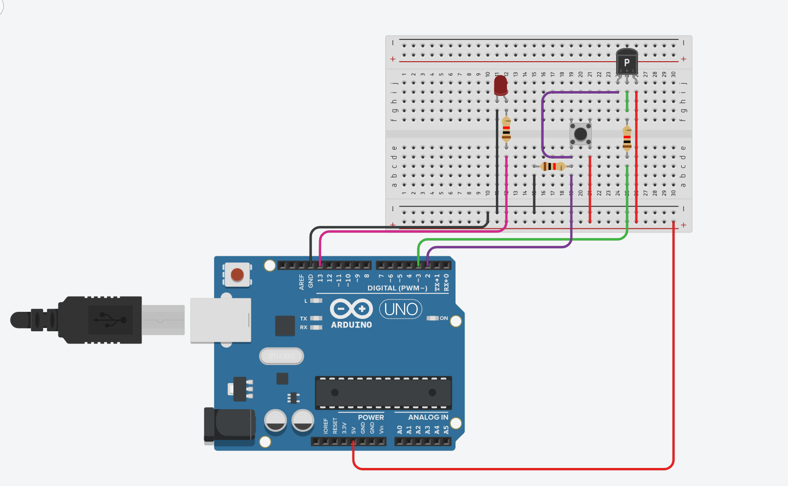
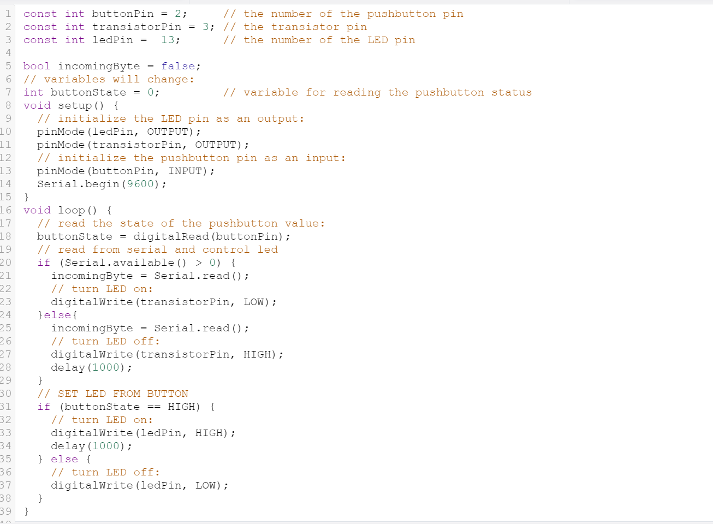

# Analog-Digital-electronic-circuits

## What is a Signal💡❓ 
**Gestures, actions, sounds, expressions tell us some information, and these are the ways of communicating one to other. Similarly signal is a way of communicating by sending information from one system to other system. In other words signal is a function that represents information or data** 

## Analog signal⬇️ 
### Analog signal is a continuous signal in which one time-varying quantity represents another time-based variable. These kind of signals works with physical values and natural phenomena such as earthquake, frequency, volcano, speed of wind, weight, lighting, etc. 

 
  
  

## The following is an example of a simple Analog Circuit.

  

## Characteristics OF Analog Signal🛠️
**Here, are essential characteristics of Analog Signal**

**○These type of electronic signals are time-varying**
**○Minimum and maximum values which is either positive or negative**
**○It can be either periodic or non-periodic**
**○Analog Signal works on continuous data**
**○The accuracy of the analog signal is not high when compared to the digital signal**
**○It helps you to measure natural or physical values**
**○Analog signal output form is like Curve, Line, or Graph, so it may not be meaningful to all**

## Connection diagram🔍
  
## Analog CODE📝  
  
  

## simulation▶️  
https://www.tinkercad.com/things/1D2NzS8KMKF   

## Digital signals⬇️
**carry binary data i.e. 0 or 1 in form of bits, it can only contain one value at a period of time. Digital signals are represented as square waves or clock signals.
The minimum value is 0 volts whereas maximum value is 5 volts, digital signals are less subjected to noise compared to analog signal**

  

## What are digital circuits used for❓

**A digital circuit is used for the transmission of power to an electronic device. It can be used to perform different operations based on the input which is given to the electronic circuit**  
  

## The following is an example of a simple digital circuit built using CD4017 Counter IC.  
  

 
## Characteristics of Digital Signals🛠️  
**Here, are essential characteristics of Digital signals**  

**○Digital signals are time separated signals**  
**○This type of electronic l signals can be processed and transmitted better compared to analog signal**  
**○Digital signals are versatile, so it is widely used**  
**○The accuracy of the digital signal is better than that of the analog signal**  
  
## Connection diagram🔍  
  
## Digital CODE📝  

  

## simulation▶️  
https://www.tinkercad.com/things/e3Ywy01Lfuj   

## Conclusion🔚
**Analogue and digital electronic design are both common in modern circuit and PCB layout design. Ultimately, the choice of circuit will depend on the specific needs of the project, and sometimes a combination of both digital and analogue electronic circuits is appropriate**
